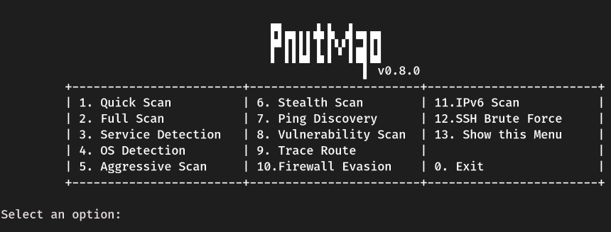

# pnutmap


## about

pnutmap is a simple interactive Python wrapper for `nmap` designed for fast network scanning from the terminal.

it provides an easier way to run common reconnaissance commands without manually typing full nmap flags every time.

built for Linux environments, learning, lab use, and authorized security testing.

---

## features




<details>
<summary>show features</summary>

<br>

- quick scan (`-F`)
- full scan (`-p-`)
- service detection (`-sV`)
- os detection (`-O`)
- aggressive scan (`-A`)
- stealth scan (`-sS`)
- ping discovery (`-sn`)
- vulnerability scan (`--script vuln`)

</details>

---

## requirements

- Linux (Debian, Ubuntu, Arch, Kali, etc.)
- Python 3.x
- nmap installed

---

## installation (linux)

### Debian / Ubuntu / Kali
```bash
pipx install pnutmap --force
```

## disclaimer

this tool is intended for educational purposes and authorized security testing only.

do not use it against systems you do not own or have explicit permission to test.

---

## license

MIT License
